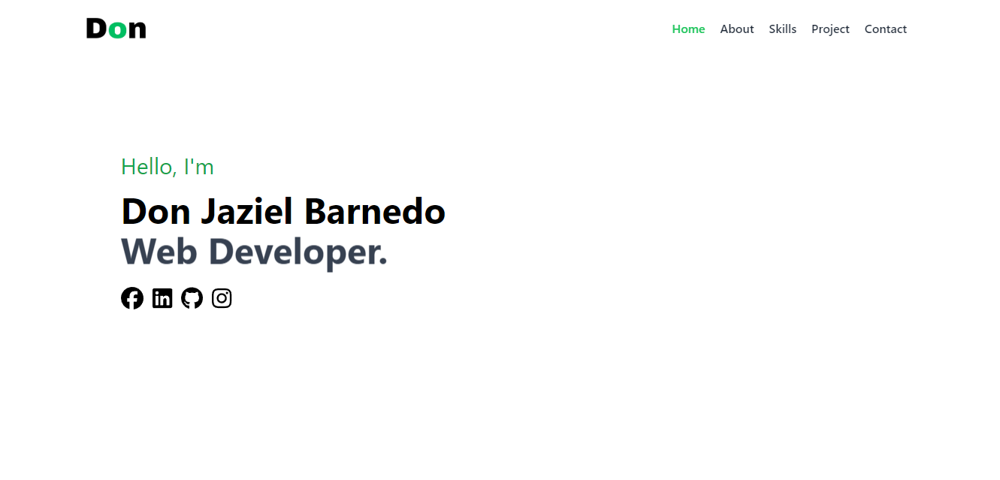

# Personal Portfolio Website [Live Demo](https://donjaziel-portfolio.vercel.app/)

This is a personal portfolio website built using **Vue.js** and **Tailwind CSS**. The website showcases my work, skills, and projects, providing a clean and modern user experience.

<p>
    
</p>

You may visit the live demo **[here](https://donjaziel-portfolio.vercel.app/)**.

## Motivation

The purpose of building this portfolio was to present my projects and capabilities while learning and applying new technologies like Vue.js, Tailwind CSS, and Laravel.

## Technologies Used

- **Vue.js**: A progressive JavaScript framework for building user interfaces.
- **Tailwind CSS**: Utility-first CSS framework for rapid UI development.

## Installation

To get started with the project, clone the repository and install the necessary dependencies.

```bash
git clone https://github.com/yourusername/your-portfolio.git
cd your-portfolio
npm install
